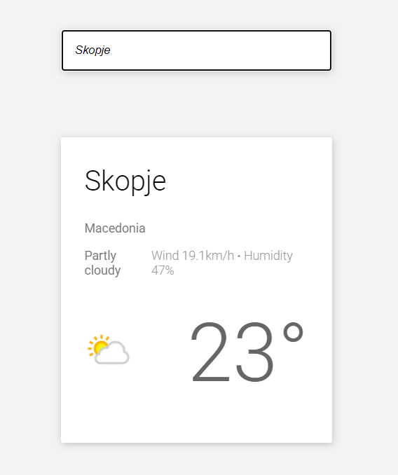

# Current Weather API :cloud_with_lightning_and_rain:

## Table of contents

- [Overview](#overview)
  - [Screenshot](#screenshot)
  - [Description](#users-are-able-to)
  - [Links](#links)
- [My process](#my-process)
  - [Built with](#built-with)
- [Project setup](#project-setup)
- [Author](#author)

## Overview

### Screenshot



#### Users are able to:

* Get their geolocation for the weather if they allow it
* Search for a city using an input field

### Links

- Live Site URL: [Demo](https://benevolent-toffee-a6c68f.netlify.app/) 👈

## My process

### Built With
- HTML5
- CSS
- Flexbox
- JavaScript
- Fetch API
- Vue 3

## Project setup
```
yarn install
```

### Compiles and hot-reloads for development
```
yarn serve
```

### Compiles and minifies for production
```
yarn build
```

### Customize configuration
See [Configuration Reference](https://cli.vuejs.org/config/).


## Author

- LinkedIn - [@Marko](https://www.linkedin.com/in/marko-hristovski-77b9a6149/)
